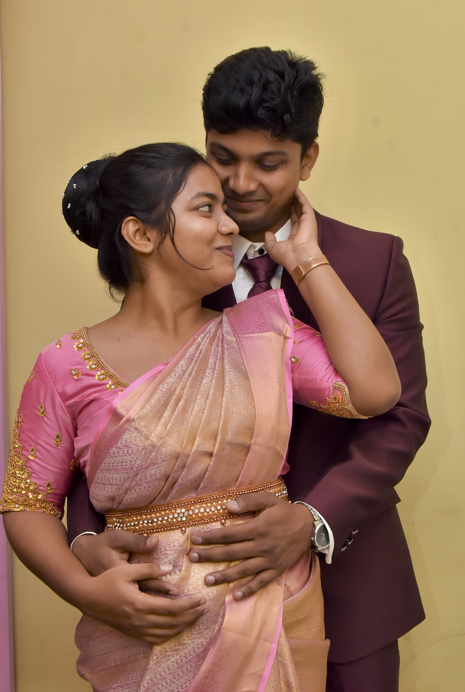
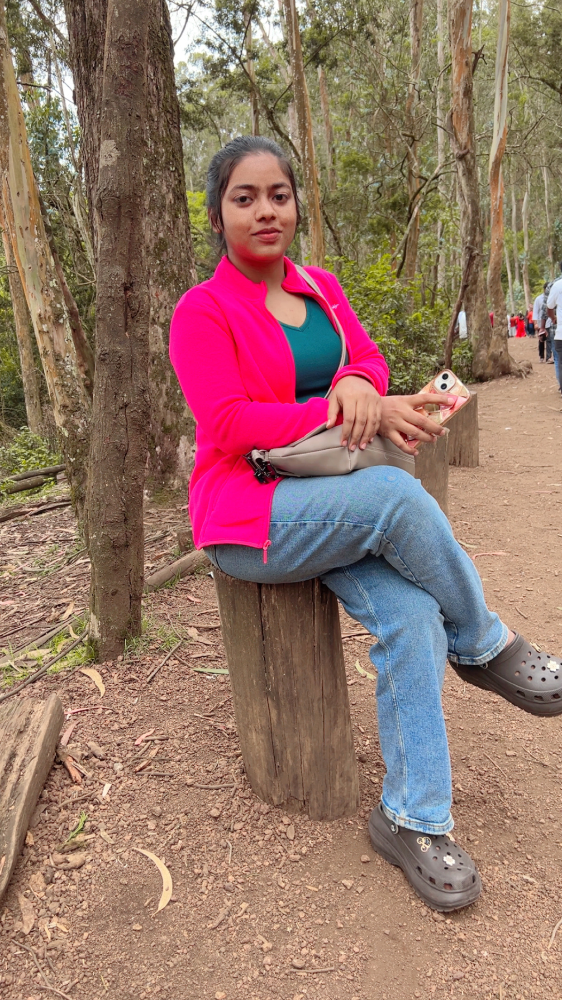
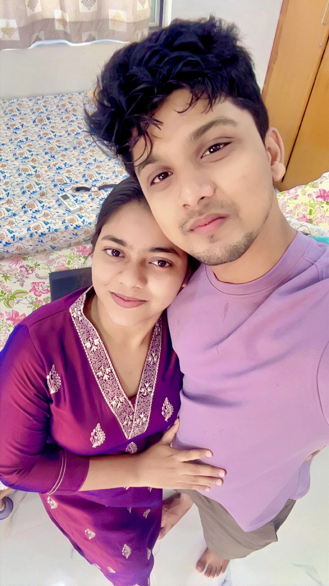
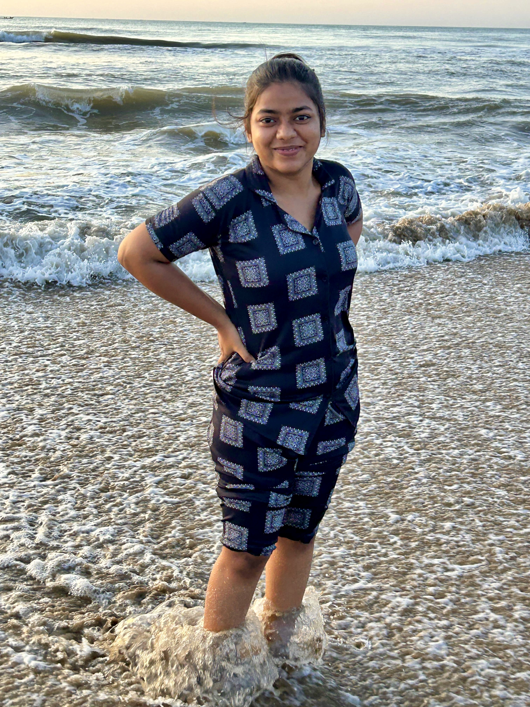
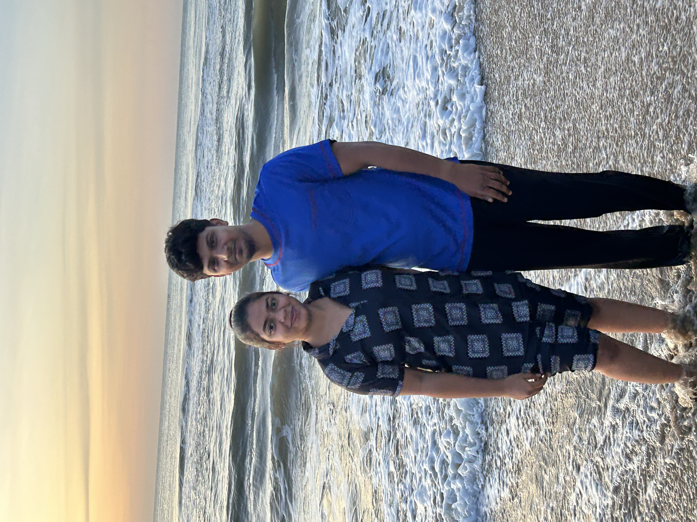
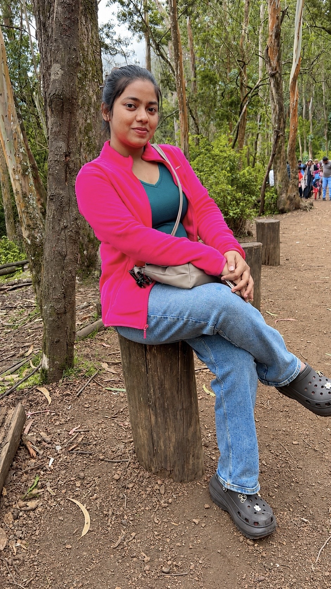
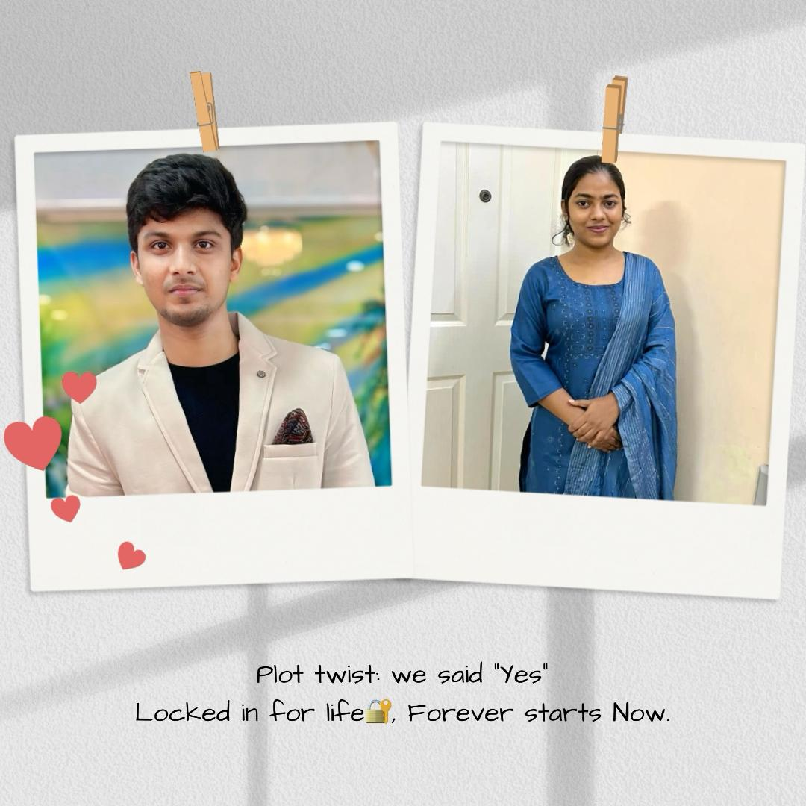
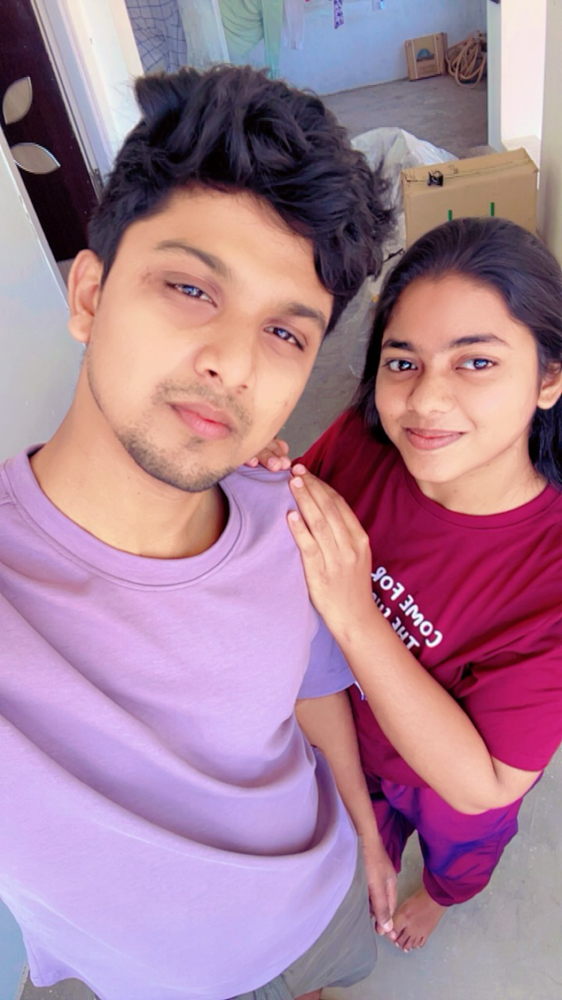

# salcomp-testing
salcomp test deptment

<!DOCTYPE html>
<html lang="en">
<head>
  <meta charset="UTF-8">
  <meta name="viewport" content="width=device-width, initial-scale=1.0, maximum-scale=1.0, user-scalable=yes">
  <title>✨ Happy 25th Birthday Sneha ❤️</title>
  <link rel="preconnect" href="https://fonts.googleapis.com">
  <link rel="preconnect" href="https://fonts.gstatic.com" crossorigin>
  <link href="https://fonts.googleapis.com/css2?family=Playfair+Display:ital,wght@0,400;0,600;0,700;1,700&family=Inter:wght@300;400;500;600;700&family=Dancing+Script:wght@400;700&display=swap" rel="stylesheet">
  
</head>
<body>

  <!-- Floating hearts & roses -->
  
❤️‍🔥

  
🌹

  
💗

  
✨

  
🌹

  
💖

  <!-- Fireworks Canvas -->
  <canvas id="fireworks-canvas"></canvas>

  <!-- Background Music -->
  <audio id="bgmusic" loop preload="auto" crossorigin="anonymous">
    <source src="Music.mp3" type="audio/mpeg">
  </audio>

  <!-- Music indicator -->
  

    🎵 Music ❤️
  

  <!-- ====== PAGE 1: PREMIUM HERO ====== -->
  

    

      

        
      

      

        <h1>🎂 Happy 25th Birthday My Beautiful Wife Sneha ❤️</h1>
        

        

          You are my happiness, my peace, my best friend, 
          and God's greatest blessing in my life. ✨
        

        
        

          ⏳
          
          Until Your Special Day
        

        
        <button class="btn-premium" onclick="goToPage(2)">Open My Surprise</button>
        
— forever yours, Pridesh ❤️ —

      

    

  

  <!-- ====== PAGE 2: GIFT BOX ====== -->
  

    

      <h2>🎁 A Special Gift For You</h2>
      

      
      

        

          

          

            

          

        

        
      

      
      

        💖 
        Happy Birthday Sneha ❤️ 
        You are my today and all of my tomorrows. 
        I fall in love with you more and more 
        with every passing moment. 
        ❤️
      

      
      
Click the gift box to open it 🎁

      <button class="button button-small" onclick="goToPage(3)" style="margin-top:8px;">Next →</button>
    

  

  <!-- ====== PAGE 3: MEMORIES ====== -->
  

    

      <h2>📸 Our Beautiful Memories</h2>
      

      
      

        
        
        
        
        
        
        
        
        
        
      

      
      <button class="gallery-next-btn" id="galleryNextBtn" onclick="goToPage(4)">Next →</button>
    

  

  <!-- ====== PAGE 4: LETTER ====== -->
  

    

      <h2>💌 My Letter To You</h2>
      

      

        
<strong>My Dearest Sneha ❤️</strong>

        
        
💫 You walked into my life and made it beautiful.

        
🌅 Every morning with you is a blessing.

        
💕 Your smile heals my soul.

        
🌟 You are my strength and my peace.

        
🤝 Thank you for loving me.

        
🔥 I will always choose you.

        
💖 You are my miracle.

        
        

          🌹 With every heartbeat, I promise you,
          My love will remain forever true.
          Through all the years, through joy and pain,
          I'll love you more with each new day again.
          🌹
        

        
        
Happy 25th Birthday My Love ❤️

        
Forever Yours, Pridesh ❤️

      

      <button class="button button-small" onclick="goToPage(5)" style="margin-top:6px;">Next →</button>
    

  

  <!-- ====== PAGE 5: REASONS - "Your Sacrifice" BOLD ====== -->
  

    

      <h2>🎁 10 Reasons I Love You</h2>
      

      

        
❤️ Your Smile - It lights up my whole world

        
❤️ Your Heart - So pure and full of love

        
❤️ Your Support - You always believe in me

        
❤️ Your Care - You always put others first

        
❤️ Your Sacrifice - You give so much for us

        
❤️ Your Honesty - You are always true to me

        
❤️ Your Laughter - The most beautiful sound

        
❤️ Your Love - It's the greatest gift I've ever received

        
❤️ Your Presence - You make everything better

        
💖 You Are You - And that's more than enough

      

      
      <button class="button button-small" onclick="goToPage(6)" style="margin-top:8px;">Next →</button>
    

  

  <!-- ====== PAGE 6: FINAL PROMISE ====== -->
  

    

      <h2>💍 One Last Surprise</h2>
      

      
      

        🌹
        🌹
        🌹
      

      
      

        Will You Keep Loving Me  For The Rest Of Our Lives? ❤️
      

      
💖

      
— yes, forever —

      
      

        ❤️ I may not be the perfect husband... 
        But I promise to love you, 
        respect you, 
        protect you, 
        pray for you, 
        and stand beside you  
        Until my last heartbeat... 
        you will always be my first choice.  
        ❤️ Forever & Always ❤️
      

      
      <button class="button" onclick="goToPage(7)" style="background: linear-gradient(135deg, #e84c4c, #c0392b); box-shadow: 0 8px 20px -8px rgba(232, 76, 76, 0.35); font-size:0.85rem; padding:10px 28px; margin-top:6px;">
        🎵 Let's Go! 🎵
      </button>
    

  

  <!-- ====== PAGE 7: VIDEO PAGE ====== -->
  

    

      <h2>🎵 Happy Birthday Sneha! 🎵</h2>
      

      

        A special song just for you my love ❤️
      

      
      

        <video id="birthdayVideo" preload="metadata" playsinline>
          <source src="birthday.MP4" type="video/mp4">
          Your browser does not support the video tag.
        </video>
        

          ▶️
        

      

      
      

        <button class="button button-small" onclick="togglePlay()" style="background: linear-gradient(135deg, #cb6b6b, #a94444); box-shadow: 0 6px 18px -6px rgba(160, 60, 60, 0.3);">
          ⏯️ Play/Pause
        </button>
        <a href="birthday.MP4" download="Happy_Birthday_Sneha.mp4" class="download-btn">
          ⬇️ Download Video
        </a>
      

      
      

        🎂 Happy 25th Birthday Sneha! 🎂
          
        I Love You Forever ❤️
      

      
      

        <a href="https://wa.me/919500134256" target="_blank" class="reply-btn">
          Reply To My Love ❤️
        </a>
        

          Click to send your reply on WhatsApp 💬
        

      

    

    
    

      ❤️ Since <strong>01 June 2026</strong> ❤️
        
      Happy 25th Birthday <strong>Sneha</strong> ❤️
        
      ✨🕊️✨
      

        "Every day with you is a gift from above"
      

    

  

  
</body>
</html>
